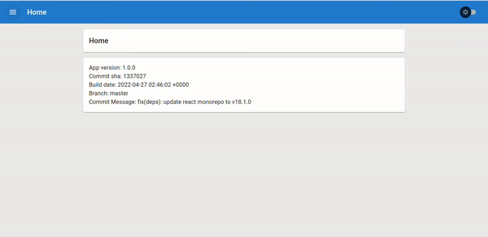
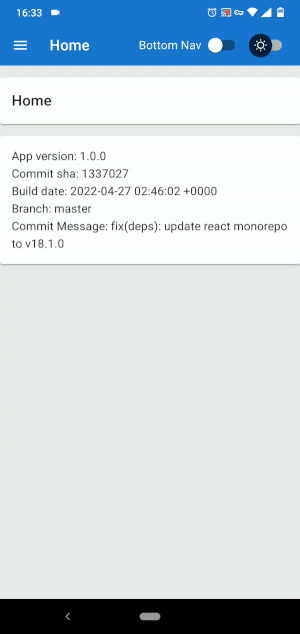
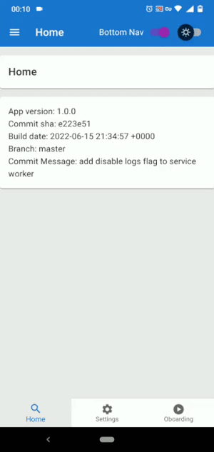
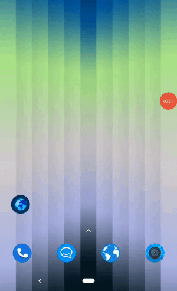

# Nextjs Material UI Progressive Web App (PWA) Template

Template for creating progressive web apps with [MaterialUI](https://mui.com/), [Next.js](https://nextjs.org/) and [Workbox](https://developer.chrome.com/docs/workbox/)

Working demo: https://material-pwa.vercel.app/

<!-- toc -->

- [Motivation](#motivation)
- [Layout](#layout)
- [Theming](#theming)
- [Onboarding slideshow](#onboarding-slideshow)
- [Service worker](#service-worker)
  * [service worker setup](#service-worker-setup)
  * [offline fallback](#offline-fallback)
  * [installation prompt](#installation-prompt)
  * [app shortcuts](#app-shortcuts)
- [Custom Babel.js config](#custom-babeljs-config)
- [Future](#future)
- [Blog post](#blog-post)
- [Useful links](#useful-links)
- [License](#license)

<!-- tocstop -->

## Motivation

Setting up PWA's involves a lot of moving parts, so I've decided to create a template repository, that I would always keep up to date, and it will enable me to get started quickly.

## Layout

The application supports both desktop and mobile layouts.

The desktop layout has a sidebar on the left side that can open and close.

The mobile layout has two options.

- Traditional layout with a sidebar that can be swiped to open/close

- Modern layout where menu items are at the bottom

## Theming

- There are two themes dark and light, and they can easily be customized.

## Onboarding slideshow

I've also included an onboarding slideshow which is usually present in native apps. This is optional and it can easily be removed.

https://user-images.githubusercontent.com/390700/174054384-3eeb975b-c39a-414a-a93c-48f6fbfefd7b.mp4

## Service worker

The real hard part of creating pwa's is service worker integration, both in the build process and in production.
Service worker functionality is implemented with the excellent [Workbox library](https://developer.chrome.com/docs/workbox/)

### service worker setup

- Service worker [`sw.js`](./src/lib/client/service-worker/sw.ts) is written in Typescript and it will be compiled together with the rest of the code. The service worker will precache all the routes, images, CSS, and google fonts. Every time the app is built new cache manifest is created.

When the service worker is installed, the application will show a prompt to reload the application so the new service worker can take over.

### offline fallback

Offline fallback is provided, if `navigation` happens when there is no network access, the fallback page will be shown. Please note that the fallback files must be pure html,css, and js (no react, or css-in-js libraries). Fallback files need to be placed in the `public` directory.

Also, there is `network offline` detection, if the browser loses network connection, there will be a notification inside the app that the application is offline. You can test this via the Chrome dev tools network tab.

### installation prompt

The application also has a custom prompt for the installation of the app. Please note that the installation prompt only works on the desktop OS'es and Android, no IOS.

### app shortcuts

The application also has set some demo shortcuts which show up if the application is installed. You can read more about PWA Shortcuts at [Get things done quickly with app shortcuts](https://web.dev/app-shortcuts/)

## Custom Babel.js config

There is a custom babel configuration, that enables you to have a couple of custom `env` var that can be used when compiling the application:

- `__VERSION__`: app version, taken from `package.json` version,
- `__DEV__`: `true` if the application is running in dev mode
- `__BUILD_DATE__`: app build date taken from the git commit
- `__COMMIT_SHA__`: git commit sha
- `__BRANCH__`: branch name,
- `__COMMIT_MESSAGE__`: git commit message

If you don't need these `env` variables, you can remove the babel config and use [Next.js compiler](https://nextjs.org/docs/advanced-features/compiler) which will increase compilation speed.

## Future

This template will be kept up to date. In the future, I might create similar templates for [Mantine library](https://mantine.dev/) and [Chakra-UI](https://chakra-ui.com/)

If you have suggestions on how this process could be improved, feel free to open an issue or pull a request.

## Blog post

I will eventually write a blog post detailing the whole setup process. You can follow me on [Twitter](https://twitter.com/iki_xx) or on [Dev.to](https://dev.to/ivandotv)
to be notified of new blog posts.

## Useful links

If you want to learn more about how to create progressive web apps with a great user experience, check out these links:

- [learn pwa](https://web.dev/learn/pwa/)
- [30 days of PWA](https://blogs.windows.com/msedgedev/2022/04/14/30-days-of-pwa-fall-in-love-with-progressive-web-apps/)
- [service worker lifecycle](https://web.dev/service-worker-lifecycle/)
- [pwa icon generator](https://maskable.app/)
- [responsively application](https://responsively.app/)
- [samsung remote test lab](https://developer.samsung.com/remote-test-lab)

## License

This project is licensed under the MIT License - see the [LICENSE](LICENSE) file for details

Image credits [flexiple.com](https://2.flexiple.com/scale/all-illustrations?search=app)

Slideshow images: [pixeltrue.com](https://www.pixeltrue.com/free-packs/lined-illustrations)
